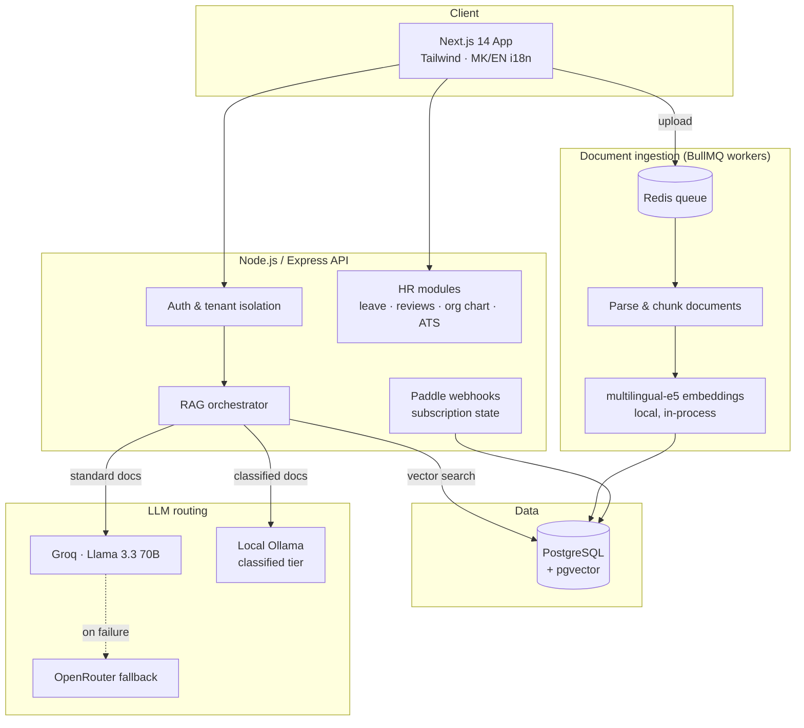

# Talbord

**AI-powered employee onboarding & training platform**

*Every new employee gets an AI assistant trained on their company's own documents.*

[Website](https://talbord.com) · [Contact](mailto:vaskodimitrov999@gmail.com) · Built by [@vasko333](https://github.com/vasko333)

---

> **Note:** Talbord is a commercial product. This repository documents its architecture and capabilities — the source code is proprietary. If you'd like a demo, [get in touch](mailto:vaskodimitrov999@gmail.com).

## The problem

Onboarding a new employee means weeks of "who do I ask about X?". Company knowledge lives in scattered PDFs, wikis, and people's heads. Small and mid-sized companies can't afford enterprise LMS platforms — and even those don't *answer questions*.

## What Talbord does

Companies upload their internal documents (policies, handbooks, SOPs, contracts). Talbord ingests them into a per-tenant vector store and gives every employee a chatbot that answers questions **grounded in their company's actual documents** — with citations, in Macedonian or English.

Around that core, Talbord ships a full HR suite: structured onboarding paths, training modules with quizzes, leave management, performance reviews, an org chart, and an applicant tracking system.

## Key features

| | |
|---|---|
| 🤖 **RAG chatbot** | Retrieval-augmented generation over company documents — semantic search via pgvector, answers with source citations |
| 🔒 **Classified tier** | Sensitive documents never leave the server: routed to **local Ollama inference** instead of cloud LLMs |
| 🏢 **Multi-tenant** | Full data isolation per company, per-tenant document stores and user roles |
| 🌐 **Bilingual** | Macedonian + English UI and multilingual embeddings (multilingual-e5) |
| 📋 **HR modules** | Leave management, performance reviews, org chart, ATS |
| 💳 **Billing** | Subscription tiers via Paddle (Merchant of Record), EU VAT handled |
| 🛡️ **GDPR** | Data export, right-to-erasure workflows, consent tracking |

## Architecture

**Design decisions worth noting:**

- **Embeddings run locally** (Xenova/transformers.js, multilingual-e5-small baked into the Docker image) — zero per-token embedding cost and no document content sent to third parties during ingestion.
- **LLM fallback cascade**: Groq is fast and cheap, but rate-limited; requests degrade gracefully to OpenRouter instead of failing. This pattern is open-sourced as [`llm-cascade`](https://github.com/vasko333/llm-cascade).
- **Classified-document routing**: tenants on the classified tier get inference on a local Ollama model — the confidential document text never leaves the server. This is the feature enterprise-averse SMBs actually ask for.
- **Single-server economics**: the whole stack runs on one Hetzner ARM box (~€17/mo), keeping unit economics viable at Micro-tier pricing (€25/mo).

## Tech stack

**Frontend:** Next.js 14 · React · Tailwind CSS
**Backend:** Node.js · Express · BullMQ · Redis
**Data:** PostgreSQL + pgvector
**AI:** Groq (Llama 3.3 70B) · OpenRouter · Ollama · multilingual-e5 embeddings · RAG with citation grounding
**Infra:** Docker · Hetzner Cloud · GitHub Actions CI
**Payments & compliance:** Paddle · GDPR tooling

## Screenshots

<!-- Add 4–6 screenshots to a /screenshots folder, then these render automatically -->
| Dashboard | AI Assistant |
|---|---|
|  |  |

| Onboarding paths | Admin / HR |
|---|---|
|  |  |

## Status

✅ Feature-complete (Phases 0–7) · 🚀 Currently in commercialization: deployment hardening, pricing tiers, go-to-market.

---

© 2026 Vasko Dimitrov. All rights reserved. This repository is documentation only; no license is granted to the Talbord source code, name, or branding.

